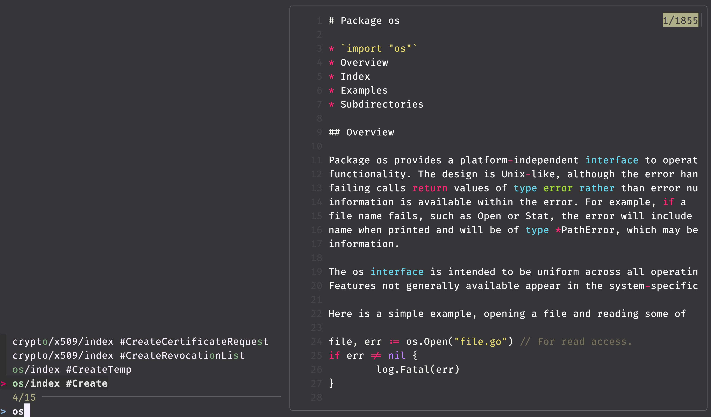

If you're looking for a TUI alternative to [Devdocs](https://github.com/freeCodeCamp/devdocs)/[Zeal](https://github.com/zealdocs/zeal)/[Dash](https://www.kapeli.com/dash), you are in the right place.

## Dedoc

[Dedoc](https://github.com/toiletbril/dedoc) is a small CLI tool for fetching documentation from the Devdocs API. It's written in Rust and it just works.
 
### Commands

- `dedoc fetch` - Get the latest metainfo of available documentations.
- `dedoc list` - List all available documentation, have to be run after `dedoc fetch`.
- `dedoc download <doc>` - Download the documentation.
- `dedoc search <query>` - Search for a documentation. Also supports opening the documentation if `-o` flag is passed.
- `dedoc open <index>` - Open the documentation.

### Problems

The main problem with Dedoc is that it doesn't have a lot of features implemented yet, like fuzzy search and quick preview of the documentation. So you should search for the documentation using `dedoc search`, copy a documentation index, and then pass it to `dedoc open`. Using the `-o` flag in the search command, you can open the first result, but it's not really convenient, as you don't know what exactly you're opening.

## Workaround

Let's cover the problems above using [`fzf`](https://github.com/junegunn/fzf) (it's a command-line fuzzy finder, really powerful) and [`bat`](https://github.com/sharkdp/bat) (a `cat` clone with syntax highlighting).

### Script

Here is my `fish` script for that. If you don't know what `fish` is, it's a shell like `bash` or `zsh`, but more user-friendly, and it is certainly worth trying.

```bash
function dedoc_parser
    for line in (dedoc search "$argv[1]" "$argv[2]" | string split '\n')
        set has_entity false
        if string match -q -r '^\s{0,3}\d+.*$' -- $line; and not string match -q -r '^\s+$' -- $line
            set parent (echo $line | string replace -r '^\s*\d+\s+' '' | string replace -r ',.*' '')
            if string match -q -r '^\s{0,3}\d+.*?#' -- $line
                set child (echo $line | string replace -r '^\s*\d+\s+.*?, ' '')
                set has_entity true
            end
        end
        if string match -q -r '^\s{4,9}\d+.*$' -- $line
            set child (echo $line | string replace -r '^\s{4,9}\d+\s+' '')
            set has_entity true
        end
        if $has_entity
            echo $parent $child
        end
    end
end

function dany
    set fzf_preview_opts "--preview-window 'right:60%' --preview 'dedoc open $argv[1] {1} | bat --paging never --style='numbers' --color always -l $argv[2]'
        --bind ctrl-u:preview-half-page-up,ctrl-d:preview-half-page-down"
    set full_index (dedoc_parser "$argv[1]" "$argv[3]" | FZF_DEFAULT_OPTS=$fzf_preview_opts fzf)
    set index (echo $full_index | string replace -r ' #' '#')
    if test -n "$index"
        dedoc open "$argv[1]" $index | bat --paging always --style='numbers' -l "$argv[2]"
    end
end
```

And I have to provide a `bash` version of the script as otherwise, it would be unfair.

```bash
function dedoc_parser() {
    while IFS= read -r line; do
        has_entity=false
        if [[ "$line" =~ ^[[:space:]]{0,3}[0-9]+.*$ ]] && [[ ! "$line" =~ ^[[:space:]]+$ ]]; then
            parent=$(echo "$line" | sed -E 's/^[[:space:]]*[0-9]+[[:space:]]+//' | sed -E 's/,.*//')
            if [[ "$line" =~ ^[[:space:]]{0,3}[0-9]+.*## ]]; then
                child=$(echo "$line" | sed -E 's/^[[:space:]]*[0-9]+[[:space:]]+.*, //')
                has_entity=true
            fi
        fi

        if [[ "$line" =~ ^[[:space:]]{4,9}[0-9]+.*$ ]]; then
            child=$(echo "$line" | sed -E 's/^[[:space:]]{4,9}[0-9]+[[:space:]]+//')
            has_entity=true
        fi

        if $has_entity; then
            echo "$parent $child"
        fi
    done < <(dedoc search "$1" "$2" | sed 's/\n/\n/g')
}

function dany() {
    fzf_preview_opts="--preview-window 'right:60%' --preview 'dedoc open $1 {1} | bat --paging never --style='numbers' --color always -l $2' --bind ctrl-u:preview-half-page-up,ctrl-d:preview-half-page-down"
    full_index=$(dedoc_parser "$1" "$3" | FZF_DEFAULT_OPTS="$fzf_preview_opts" fzf)
    index=$(echo "$full_index" | sed -E 's/ #/#/')
    if [[ -n "$index" ]]; then
        dedoc open "$1" "$index" | bat --paging always --style='numbers' -l "$2"
    fi
}
````

`dany` function gets 3 arguments:
- `documentation` - the name of the documentation you want to search in, whole list can be found using `dedoc list`.
- `language` - the language of the documentation, it's used for syntax highlighting. I've tried to use markdown but highlighting with specified language works much better as the documentation contains a lot of code.
- `query` - the documentation you want to search for, if the query is empty, the fuzzy search will include all entities.

The script isn't perfect, but it's a good start. Maybe it would be better to add a mapping for all languages, but as I'm going to use the command through aliases, I didn't do that.

### Usage

Just add the script to the shell configuration file and reload the shell. Then you can use the `dany` function to search and open the documentation.

```sh
## this will open fuzzy finder with preview
dany python~3.10 python

## this first search for documentation using `dedoc` and then open fuzzy finder
dany python~3.10 python typing  
```

In fuzzy search, you can use `ctrl-u` and `ctrl-d` to scroll the preview window.

The result should look like this:


### Aliases

To quickly search and open documentation, the following aliases can be added to the shell configuration file.

```sh
alias dpy='dany python~3.10 python'
alias dpy313='dany python~3.13 python'
alias dgo='dany go go'
```

So now you can just type `dpy` or `dgo` to search and open documentation.

## Conclusion

It's not the best solution, but it's a solution. I hope that `dedoc` will be improved and will have more features in the future.
